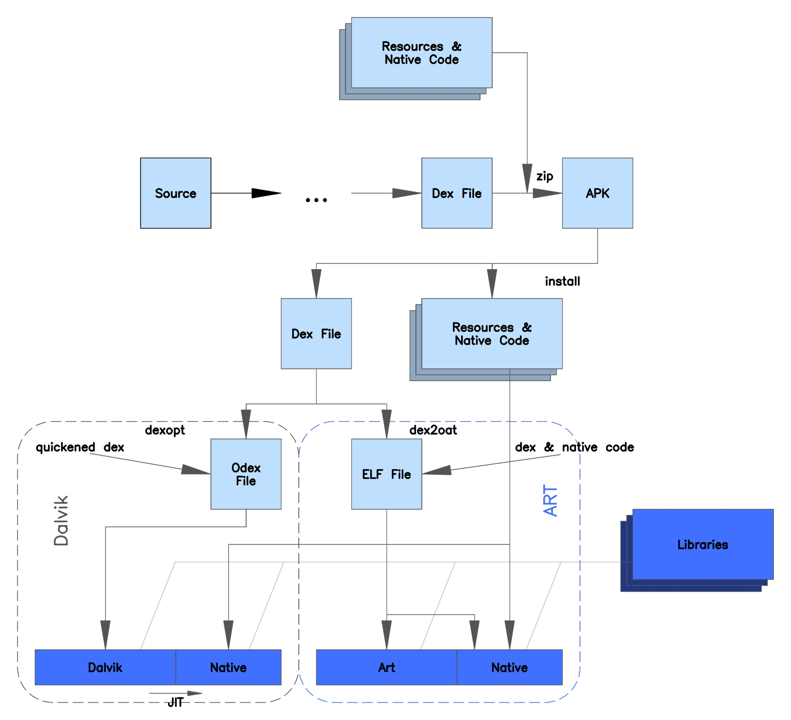

#写出来的效果
1. 清晰地提出问题，需要解决的技术问题是什么，技术挑战有哪些，背景知识有哪些；
2. 总结直到当前的技术进展，按照统一的思路将各种已有的解决方案和技术分类，让整个话题的前后发展变得清晰；
3. 评论各类方案的优缺点，尤其是在哪些情况下会导致问题；
4. 提出这个方向目前主要存在的、还没解决或者没有彻底解决的问题，给后续研究提供线索。

# janus(CVE-2017-13156)漏洞分析
17.7.31 DexGurad 向谷歌报告此问题
17.11  Google向合作伙伴发布补丁
17.12.4 Android更新安全公告并分配CVE编号(CVE-2017-13156)

#漏洞产生原因：
在4.4.3上的机器上安装失败
adb安装显示     Failure [INSTALL_FAILED_INVALID_APK]
apk包安装显示   There was a problem parsing the package

影响范围使用ART虚拟机的5.0～8.0

#安装机制：ART和安装过程

ART引入了AOT（Ahead of Time）这种预编译技术，在应用程序安装的过程中，ART就已经将所有的字节码重新编译成了机器码。应用程序运行过程中无需进行实时的编译工作，只需要进行直接调用。
由于ART采用和dalvik在执行上的不同

#应用安装涉及到的目录
/system/app ：系统自带的应用程序，获得adb root权限才能删除
/data/app ：用户程序安装的目录。安装时把apk文件复制到此目录
/data/data ：存放应用程序的数据
/data/dalvik-cache：将apk中的dex文件安装到dalvik-cache目录下(dex文件是dalvik虚拟机的可执行文件,当然，ART–Android Runtime的可执行文件格式为oat，启用ART时，系统会执行dex文件转换至oat文件)
/data/system ：该目录下的packages.xml文件，类似于Windows的注册表，这个文件是在解析apk时由writeLP()创建的，里面记录了系统的permissions，以及每个apk的name,codePath,flags,ts,version,uesrid等信息，这些信息主要通apk的AndroidManifest.xml解析获取，解析完apk后将更新信息写入这个文件并保存到flash，下次开机直接从里面读取相关信息添加到内存相关列表中。当有apk升级，安装或删除时会更新这个文件。
/data/system/packages.xml中内容详解(这里列举的标签内容不一定完整，只是列举核心内容，packages.xml的完整定义详见官方文档)：

#app的安装
四种安装方式：
系统应用安装：开机时加载系统的APK和应用，没有安装界面；
网络下载应用安装：通过各种market应用完成，没有安装界面；
ADB工具安装：即通过Android的SDK开发tools里面的adb.exe程序安装，没有安装界面；
第三方应用安装：通过SD卡里的APK文件安装(比如双击APK文件触发)，有安装界面，系统默认已经安装了一个安装卸载应用的程序，即由packageinstaller.apk应用处理安装及卸载过程的界面。

安装过程：
1.拷贝到/data/app目录下  com.example.app/base.apk

2.解压apk，拷贝文件。创建应用的数据目录
为了加快app的启动速度，apk在安装的时候，会首先将app的可执行文件（dex）拷贝到 /data/dalvik-cache 目录，缓存起来。
然后，在/data/data/目录下创建应用程序的数据目录（以应用的包名命名），存放应用的相关数据，如数据库、xml文件、cache、二进制的so动态库等等。

3.解析AndroidManifinest.xml

4.向Launcher应用申请添加创建快捷方式
 AndroidMainfest.xml在主启动项里添加Launcher
#漏洞利用
##1.pass AV的过程：
为什么杀毒引擎检测不出，杀软本地扫描的政策

如何检测：
1.防止上架
dex在应该上架不了

2.防止作为payload来释放
1.卫士静态扫描dex？？

2.云查

##伪造升级，继承原有权限

一般app应用的更新如下：
1.通过第三方市场更新
相信大家对于如何安装一个Apk都比较熟悉吧，原理也是比较简单的。

（1）通过downloadId获取下载的Uri。

（2）将Uri设置到Itent的setDataAndType作为启动条件。

（3）调用startActivity启动对应Intent即可。
2.打开应用，提示更新

/data/system ：该目录下的packages.xml文件，类似于Windows的注册表，这个文件是在解析apk时由writeLP()创建的，里面记录了系统的permissions，以及每个apk的name,codePath,flags,ts,version,uesrid等信息，这些信息主要通apk的AndroidManifest.xml解析获取，解析完apk后将更新信息写入这个文件并保存到flash，下次开机直接从里面读取相关信息添加到内存相关列表中。当有apk升级，安装或删除时会更新这个文件。
/data/system/packages.xml中内容详解(这里列举的标签内容不一定完整，只是列举核心内容，packages.xml的完整定义详见官方文档)：

